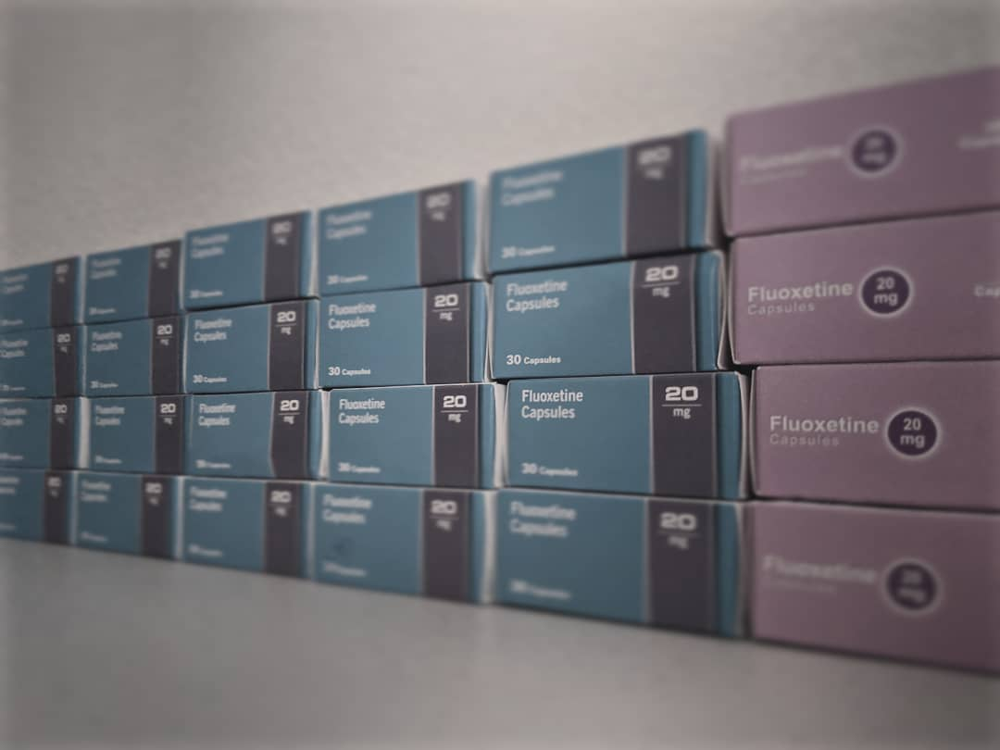

> 🙅 **Disclaimer:** despite working for a medical tech company, I know _next to
> nothing_ about _anything_ in medicine. This post is part rant, part PSA, but
> **absolutely not medical advice!**

Almost exactly one year ago, I stuffed my carry-on with ~73 boxes of Fluoxetine
(_aka_ Prozac) and left for Heathrow airport. I was flying to Japan with a
Working Holiday Visa, but to onlookers, I probably looked like a middle-class
drug mule.

My decision to move to Japan was somewhat spontaneous – long-term planning
wasn't a concern during the insane uprooting of my UK life to this country on
the other side of the planet – but one thing I _did_ manage to get right was the
medical preparation.

Medical preparation for a year that is, because the availability of modern
antidepressants in Japan turned out to be... somewhat lacking.

---

**In this post:**

- 💊 History & availability of treatments
- 🙋‍♂️ How to get to Japan with a year's supply of antidepressants

This subject, and indeed that of mental health in general here in Japan,
deserves a great deal more coverage and discussion. Unfortunately, I'm working
with a limited capacity to understand Japanese, so it's possible information
here is out of date or just plain wrong.

_Please reach out to me ([@MorrisonCole](https://twitter.com/morrisoncole)) if
you have any corrections and/or suggestions!_

### I: Back to the 80s

Although antidepressants are
[still not very good](<https://www.thelancet.com/journals/lancet/article/PIIS0140-6736(17)32802-7/fulltext#fig3>)
in general, there is little doubt that they are an effective first line
treatment for depression. In fact, there are so many drugs available that we
normally just refer to them by their mechanism (presumably in order to avoid
having to blurt out weird and wonderful compound names during patient-doctor
conversations).

The most common of these categories are SSRIs. These are what you're likely to
be prescribed if you visit your doctor in Europe for that difficult but
oh-so-necessary depression chat.

> I've taken two SSRIs since I first got help for major depressive disorder a
> few years ago - _Citalopram_ and _Fluoxetine_. Since 2018 I've been on varying
> dosages of the latter, but I was surprised to discover while researching this
> post that it was actually first legalised in the US all the way back in 1988
> 👴🏼!
>
> I chose the drug with the advice of my doctor, but in general, Fluoxetine
> seems to be a reasonably safe bet. It has a better-than-placebo dropout rate
> due to 'adverse events' and decent efficacy.

I'd forgive you for assuming that a 32-year-old antidepressant would be
available here in Japan, but you would be wrong. Japan is a time warp sometimes,
and when it comes to mental health, it's no exception.

### II: 何それ？美味しいの？

None of the antidepressants I was familiar with in the UK are available here -
most have either failed to be approved or simply gave up on their effort to
enter the Japanese market. When I first looked over the list with my doctor
before I left, I didn't recognise anything.

That's not to say that there are no antidepressants available — the first SSRI
to be approved in Japan was Fluvoxamine in 1999 (incidentally, 5 years after it
entered the US market) — and more have been approved since.

The newest (available since 2010) and most widely-prescribed (as of 2017) is an
SNRI named _Duloxetine_, which unfortunately seems to have a fairly high rate of
'adverse events' (honestly, could they chose a more ominous phrase!?). Despite
that, it has significant efficacy _if_ taken to. More recently, _Vortioxetine_
was approved in Japan and
[will be commercialised soon](https://www.takeda.com/newsroom/newsreleases/2019/takeda-and-lundbeck-announce-ministry-of-health-labour-and-welfare-mhlw-approval-of-trintellix-in-japan/)
💸.

### III: Entering Japan

Before try to get through airport security with a rucksack full of illegal
drugs, you obviously have to do a little paperwork. Despite the rumours, you
won't need a fax machine for this one.

Despite strict internal regulation, Japan allows the import of personal
medicines (for the most part). If you need more than 1 month's supply, you'll
need a form known as a '_yakkan shoumei_' 「薬監証明」.

_Naturally, I brought a years supply with me:_

It's not enough to just fill out the form - prior to departure you must send
your application to the 'Ministry of Health, Labour and Welfare' and receive
approval.

Since I was entering via Kansai, I had to get in touch with the 'Kinki Regional
Bureau of Health and Welfare'. Yes, I could use email. No fax machines in sight!

> 💡 You can find general advice and contact information in English about the
> whole process at
> [mhlw.go.jp](https://www.mhlw.go.jp/english/policy/health-medical/pharmaceuticals/01.html).
>
> For printable application forms, you'll need to visit the (very strange)
> [narcotics subdivision](http://www.ncd.mhlw.go.jp/en/application.html).

Happily I recieved import approval and signed documents just 1 day after
emailing my submission over (contained: _flight receipts_, _signed UK
prescription_, & _application forms_). Efficient!

Moving countries is never easy, and honestly I would rather not go through this
process ever again, so... good luck if you're facing it 😅... but I'll never
forget the look on the two customs officers faces as I arrived at Kansai
International Airport with a rucksack literally _full_ of Fluoxetine (to my
surprise, they dilligently counted each and every box before giving me the all
clear). Maybe it was worth it just for that!

### IV: A New Hope

As for me now, my Fluoxetine supplies are
[dwindling](https://www.youtube.com/watch?v=MvyP4Q870ZQ&feature=youtu.be&t=177)
and I'll soon be faced with the rather unattractive options of either **a)**
navigating the prescription process in Japan and transitioning to a different
drug, **b)** coming off altogether, or **c)** checking whether I can bring
another years supply upon my return from a holiday in the UK.

Thankfully though, there are at least _some_ options here, and whilst the whole
process is slightly intimidating, I'm lucky to have some amazing people around
me that are happy to lend a hand!

Perhaps one day this will no longer be a problem, but until then, make sure to
buy a big backpack.

---

##### Sources & Further Reading:

- [https://en.wikipedia.org/wiki/Antidepressants_in_Japan](https://en.wikipedia.org/wiki/Antidepressants_in_Japan)
- [https://en.wikipedia.org/wiki/Antidepressant#History](https://en.wikipedia.org/wiki/Antidepressant#History)
- [https://www.reddit.com/r/JapanTravel/wiki/faqs/japantravel#wiki_is_my_favorite_cold_medicine_considered_a_quasi-drug_in_japan.3F](https://www.reddit.com/r/JapanTravel/wiki/faqs/japantravel#wiki_is_my_favorite_cold_medicine_considered_a_quasi-drug_in_japan.3F)
