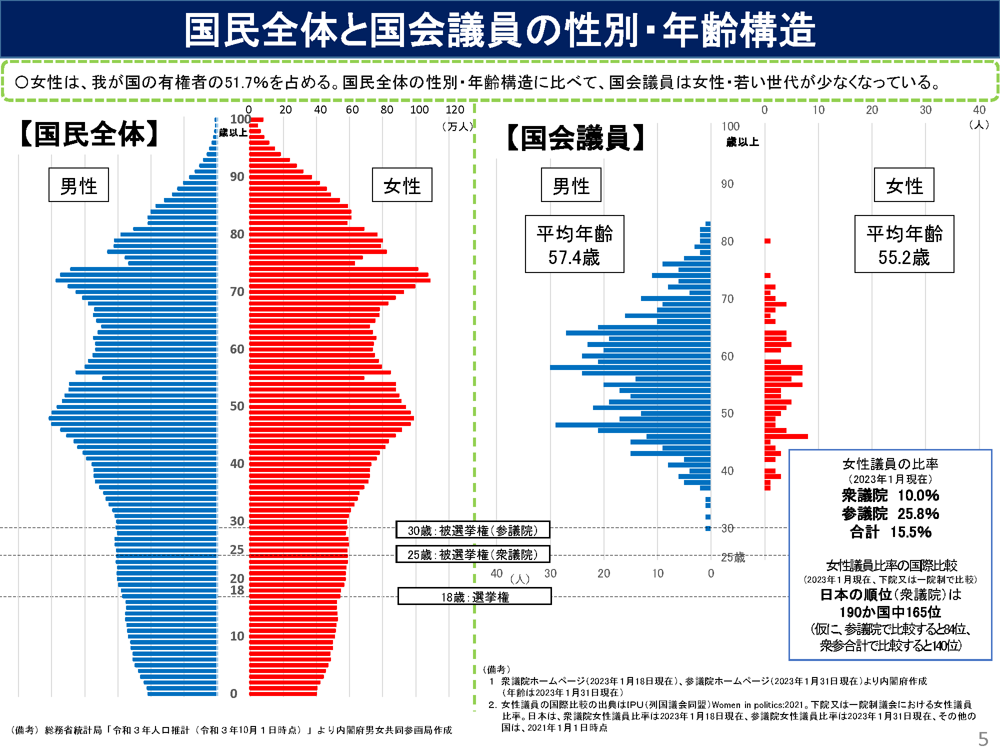
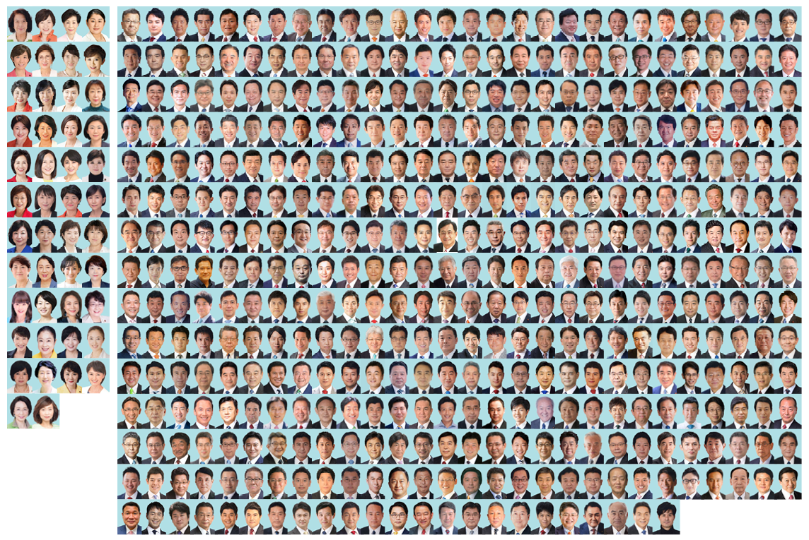

With the [Women's March Tokyo](https://womensmarchtokyo.wordpress.com/) coming
up in just 4 days (March 8th, 2023) I wanted to make some kind of placard with
recent gender breakdown data for the Japanese government.

### Gender Equality Bureau

The government has a Gender Equality Bureau which
[publishes various statistics](https://www.gender.go.jp/research/index.html),
including gender breakdowns (binary only) for the lower and upper houses.

There's a nice (if complicated) visualisation of the general population gender
breakdown vs the government included in the
['Current Status and Challenges of Gender Equality in Japan' report](https://www.gender.go.jp/research/pdf/joseikatsuyaku_kadai.pdf)
(note that the English version is only available up to 2022 at the moment):

But... honestly who wants to see this on a sign in a protest?

I wanted to visualize what this government actually looks like.

### Getting the Official Profile Pictures of the Government

There are official websites for both the lower and upper houses of the Japanese
government. Each is a bit different, but both have a list of all the members -
photos included!

Unforunately, both sites didn't have any kind of API, but this wasn't my first
web-scraping rodeo, so it didn't take too long to throw together a few bits of
Python to grab all the photos.

> [You can find all the code I used for this on GitHub](https://github.com/MorrisonCole/japanese-government-gender).
> I'm not a Python expert though - this is incredibly hacky and probably not
> that useful to anyone else 😅

The upper house actually prefixes all the profile picture alt texts with a
mr/ms, making the categorisation a bit easier. The lower house doesn't, so at
first I tried to use image recognition.

### Face / Gender Prediction

I tried using [cvlib](https://github.com/arunponnusamy/cvlib) for facial
recognition, but it
[didn't work very well](https://github.com/arunponnusamy/cvlib/issues/8). I
think this is because the images are passport-like. The frontal face detector
from [dlib](https://www.visiongeek.io/2018/04/cnn-face-detector-dlib.html)
worked well, but I couldn't find a gender predictor model that was trained on
Japanese faces and eventually gave up (the model available in cvlib was a
disaster and is presumably trained on western faces).

Ultimately this was a dead end, but it was interesting trying to get it to work.

### Some More Problems 🙃

I think it's time to talk about some of the problems with this whole project.

For starters, the way we should probably report on gender is through
self-reported gender identities, but that's not the lens through which
statistics like this are reported on at the moment. As such, we normally just
have 'male'/'female'.

Secondly, I'm haven't looked at this through a lens of intersectionality. There
are definitely other axes of oppression that are important to consider.

### Manually Guessing Genders of the Lower House 🫠

Since I had the profile pictures of all the members of the lower house, and the
total counts of female/male, I wrote a quick Python program to display the
images and allow me to categorise them.

> Dystopian sidenote: Tinder for choosing political representatives? 🤔

I checked the final results against the counts I had from the equality report
and they matched. (Note: I do hope that I haven't misgendered anyone through
this process, and will edit this post if notified of any errors.).

### Visualising the Lower House

Let's get straight to it. This is what the lower house looks like:

Pretty wild, right? 😳

I pulled this together with Adobe InDesign (installed it for the first time just
for this project since it was the only thing I could find to make a photo grid
easily 😅). The images are a bit downsampled so they don't look great, but it
gets the point across I think.

I'm still working on the actual placard for the march (need to add some more
global-oriented things) but will update with photos from the event when it's
over.

Hope to see you there! ✊

---

_Thanks for reading! Feel free to reach out to me
([@MorrisonCole](https://twitter.com/morrisoncole)) if you have corrections,
suggestions, comments, hatemail etc._
