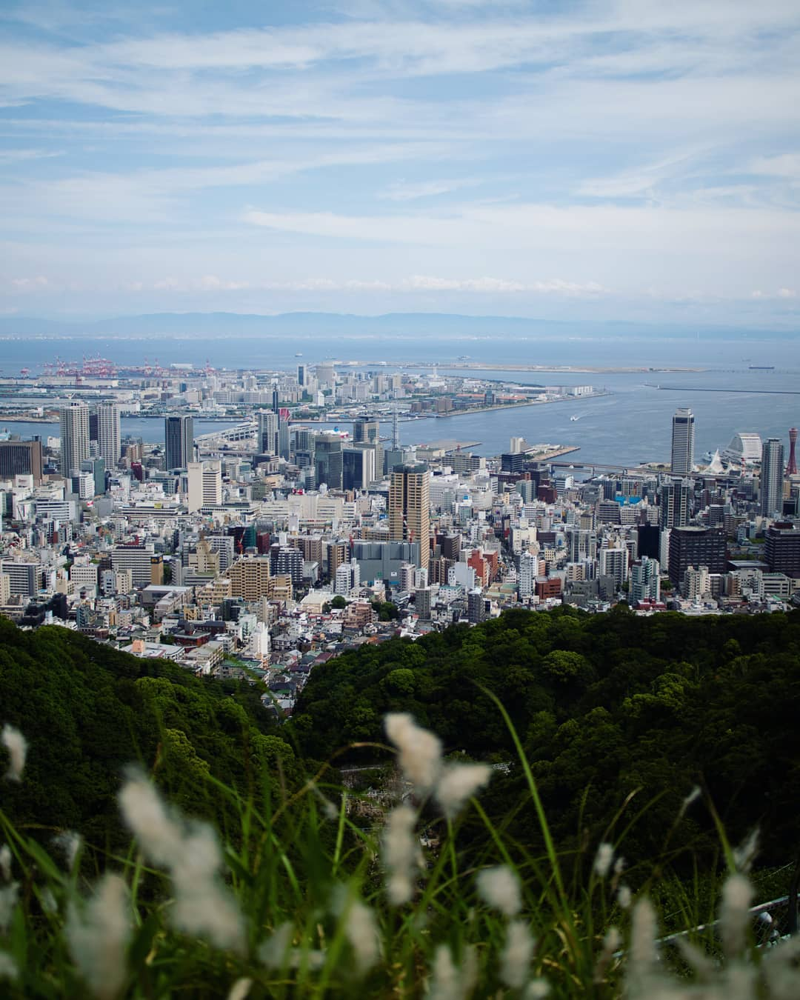

export const meta = {
  title: "One Year in Japan 🎌",
  date: "2020-04-29",
  updated: null,
  description: "365 days exploring a culture on the other side of the world.",
  category: "Japan",
  image: "kobe.jpg",
  imageAlt: "Kobe Skyline",
  linkText: "Or, life with a middle name...",
  draft: false,
};

---

As Instagram so helpfully reminded me this morning: today marks the 1st
anniversary of my arrival in Japan. I arrived somewhat stereotypically — with a
backpack and my favourite guitar — intending to spend the next 365 days learning
the language and seeing as many new places as possible.

Along the way, I've found love (more than once), eaten more 'ice cream fruits'
「アイスの実」 than any other living human, and become accustomed to the regular
shakes of the earth as the tectonic plates scrape and halt beneath us.
Maddeningly, I've also failed to navigate life as a human being with a _middle
name_.

### I: Free in Kansai

I had just finished around 6 months of making YouTube videos with my band in
London, and my plan was to continue from Japan. I had no job, and indeed no
plans to work for a while. By making videos, I'd be able to stay busy in-between
trips. After all, one can't hike _all_ the time.

I soon discovered that:

1. Even when I was exhausted, I was drawn outside to the people and places. I
   couldn't stay put long enough to even _begin_ writing.
2. Remote collaboration on songs is tricky at best and nigh impossible at worst.

Moving here was like hitting reset - a 'have you tried turning it off and on
again' for my life. I was imbued with a childish sense of wonder as I discovered
new foods, culture, and ways of living. I met new and exciting friends and
relied upon them as guides to a new life. I quickly ditched my plans to continue
creating content and instead spent my time exploring.

### II: A Second Language

To be lost without a map generally seems like a bad idea. While hiking here, I
quickly realised that by just 'having a map', I could not entirely avoid the
problem. More than once, I found myself lost in the mountains of Kansai
clutching nothing but a guide book written in Japanese. A love for the language
and willingness to learn are relatively useless characteristics when you're out
of phone signal, and the nearest advisor is a wild boar.

Once, I arrived sweatily to a small shrine near the peak of a mountain where I
discovered a guest book stored in a small box (pen helpfully included). After
signing my name, I read through some of the older comments with curiosity. The
one that stood out was from a French visitor. It read: "it's beautiful, but
please translate your signs into English".

To be honest, fellow tourist, it's part of the charm.

### III: Life With a Middle Name

I haven't always been completely taken with my middle name. 'Field' tends to
evoke a state of shock in the listener, and I'm often forced to brush it off
with a lousy joke about just how much my parents must have been smoking at the
time they named me. Having said that, I love my middle name and (Mum, if you're
reading this) I wouldn't change it for anything.

Coming to Japan took my middle name from the sidelines straight to the
spotlight. In this land of bureaucracy, it is a source of endless pain,
frustration, and even financial difficulty.

Why?

In Japan, as far as I understand, people don't have middle names. Official forms
tend to require that your name matches the one printed on your passport.

City hall staff, bank tellers, immigration officials, and countless others have
regularly been baffled by the apparently strange word inserted between my first
and last names. The conversations typically go something like this (although
feature more broken Japanese and much less sarcasm):

> "Yes, sir, that's my middle name".
>
> "Yes, that's right - it's not on that other document".
>
> "Why? Because their system didn't allow it, that's why".
>
> "...I don't think I can change it if I couldn't add it in the first place".

And so on.

You can forget online forms. Mostly, there is nowhere to even enter a middle
name. If there is, sometimes you can't add a space in the right place. Or your
name is too long.

I would have never guessed that something so inconspicuous could be the catalyst
for so many troubles, but there it is. _Field_.

There is so much to say about my time here. Some of these topics deserve entire
posts, and those I'm most passionate about don't really even get a mention. For
now, this will have to do!

---

_I doubt you made it this far, but if you did, I sometimes post about life in
Japan on Twitter [@MorrisonCole](https://twitter.com/morrisoncole) - I'd love to
see you there!_
