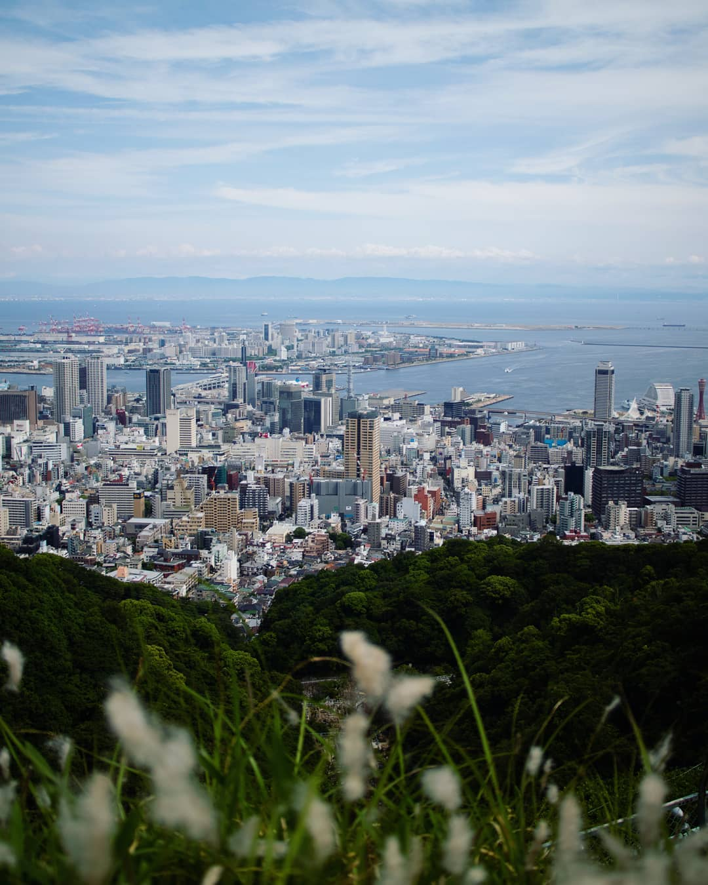
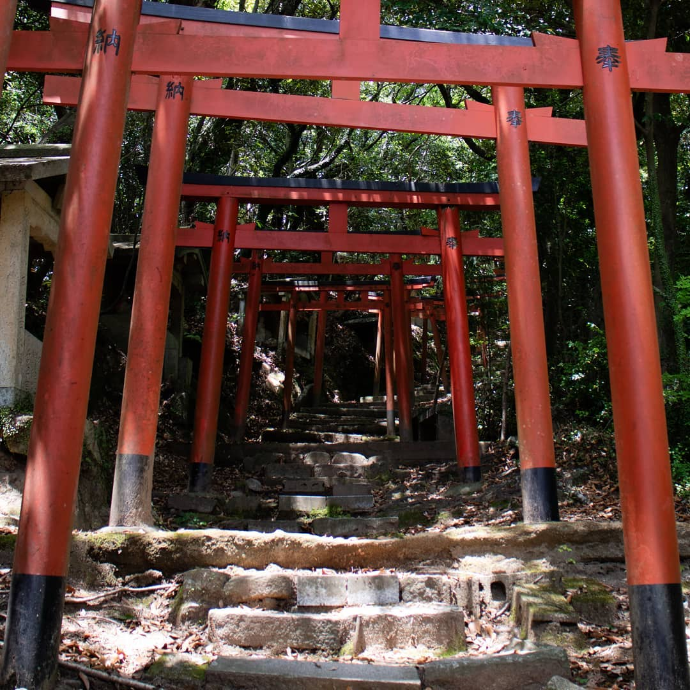

As Instagram so helpfully reminded me this morning: today marks the 1st
anniversary of my arrival in Japan. I arrived stereotypically — with a backpack
and my favourite guitar — intending to spend the next 365 days learning the
language and seeing as many new places as possible. I had very little idea what
would come after that.

Along the way, I found love (more than once), ate more「アイスの実」 than any
other living human, and become somewhat accustomed to the regular shakes of the
earth as the tectonic plates scrape and halt beneath us. Surprisingly, I've also
failed to navigate life as a human being with a _middle name_.

### I: Kansai

When I arrived in Kobe, I had just finished around 6 months of making YouTube
videos with my band in London.

I had no plans to stop making them. In fact, I had been planning to go back to
London for at least a month to get some recording done. By making videos, I'd be
able to stay busy in-between return trips.

I soon discovered that:

1. Even when I was exhausted, I was drawn outside to the people, places, events,
   and language learning. I couldn't stay put long enough to even _begin_
   writing.
2. Remote collaboration on songs is tricky at best and nigh impossible at worst.

> Writing from the future, COVID has changed all that (remote collaboration has
> been normalized, yay!). At the time though, there weren't many tools for doing
> so.

I didn't intend it to, but my creative habit died a quick death, and nothing of
value was created for the entire year. Maybe I just needed a break.

### II: A Second Language

To be lost without a map generally seems like a bad idea. While hiking here, I
quickly realised that by just 'having a map', I could not entirely avoid the
problem. More than once, I found myself lost in the mountains of Kansai
clutching nothing but a guide book written in Japanese. A love for the language
and willingness to learn are relatively useless things when you're out of phone
signal and the nearest advisor is a wild boar.

Once, I arrived sweatily to a small shrine near the peak of a mountain where I
discovered a guest book stored in a small box (pen helpfully included). After
signing my name, I read through some of the older comments. One from a French
visitor read: "it's beautiful, but please translate your signs into English".

Dear visitor: let's keep the linguistic imperialism off the mountains, please.

### III: Life With a Middle Name

I haven't always been completely taken with my middle name. When I tell people
it is 'Field', they are sometimes confused as to what I said. Often, while
repeating it to a still-confused listener, I make some excuse about just how my
parents were hippies and I have no idea what they were thinking. Then, I
remember that my sisters have similar middle names and that I do kind of love
it, and want to take it back.

Coming here took my middle name from the sidelines straight to the spotlight. It
is now a source of endless pain, frustration, and even financial difficulty.

Why?

Well, simply put, most people don't have middle names, so systems are not built
to support them. I suppose that's the case in a lot of places, but I never
really thought about it until I was struggling to open a bank account. Official
forms tend to require that your name matches the one printed on your passport,
and mine (unfortunately) has mine written in capital letters.

City hall staff, bank tellers, immigration officials, and countless others have
regularly been baffled by the strange word between my first and last names. The
conversations typically go something like this (although feature more broken
Japanese and far less sarcasm):

> "Yes, that's my middle name".
>
> "Yes, that's right - it's not on that other document".
>
> "Why? Because their system didn't allow it, that's why".
>
> "...I don't think I can change it if I couldn't add it in the first place".

And so on.

You can forget online forms. Mostly, there is nowhere to even enter a middle
name. If there is, sometimes you can't add a space in the right place. Or your
name is too long.

I would have never guessed that something so inconspicuous could be the catalyst
for so many troubles, but there it is. _Field_.

There is so much to say about my time here. Some of these topics deserve entire
posts, and those I'm most passionate about don't really even get a mention. I'll
try to write more about the things that have meaning to me some other time, but
for now my random thoughts lead me here, so it is where we will end.

---

_I doubt you made it this far, but if you did, I sometimes post about things on
Twitter [@MorrisonCole](https://twitter.com/morrisoncole) - I'd love to see you
there!_
